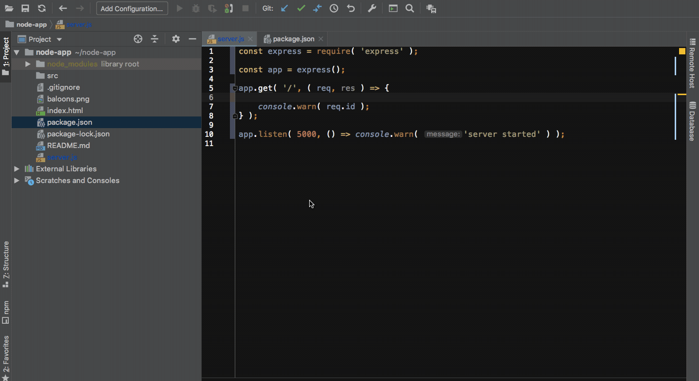

# Node playground

## Description :clipboard:
> A demo app for node

## Chrome Developer tool for Node Demo:video_camera:

## Branches Information

1. [event-emitter](https://github.com/imranhsayed/node-playground/tree/event-emitter) Example for Node Events( using http ) 
2. [file-uploads](https://github.com/imranhsayed/node-playground/tree/file-uploads) Example for File Uploads in node using Formidable module( using http )
3. [send-email](https://github.com/imranhsayed/node-playground/tree/send-email) Example for sending email using nodemailer package ( using http )
4. [sendfile-express](https://github.com/imranhsayed/node-playground/tree/sendfile-express) Send an index.html file using res.sendFile ( with express ) to port 8080 where you can view it in the browser on `localhost://8080`. 
5. [path-example](https://github.com/imranhsayed/node-playground/tree/path-example) Example for using the path module that comes shipped with node.
6. [chrome-debugger](https://github.com/imranhsayed/node-playground/tree/chrome-debugger) Example for using Chrome Debugger

* Add a `debugger` in your code.
* Run your file using command `node --inspect filename.js`
* Open Chrome Tool in browser by going on `chrome://inspect/`
* Click on Target > Inspect
* Now run your server at `http://localhost:5000` in browser.
* It will hit the debugger and open the chrome developer tool . Then you can see the values of different variables and debug.  

## Common Commands :computer:

1. `npm run dev` runs node on port 8080 by running server.js file 
2. `npm run dev:watch` runs node on port 8080 in watch mode by running server.js file 
